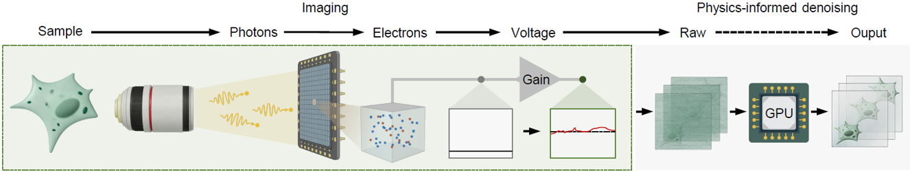

# DeepPhD: Physics-informed self-supervised denoising for fluorescence imaging

### [Project page](https://cabooster.github.io/DeepPhD/) | [Paper](https://cabooster.github.io/DeepPhD/)

## Contents

- [Overview](#overview)
- [Repository structure](#repository-structure)
- [Installation](#installation)
- [Quick start](#quick-start)
- [Results](#results)


## Overview

Fluorescence microscopy is fundamentally limited by noise, which compromises imaging sensitivity and obscures biological phenomena. Noise originating from different optoelectronic sources exhibits distinct statistical properties. The heterogeneity of noise poses critical challenges for reliable noise removal.

<p align="center">
  
</p>

**DeepPhD** (<ins>Deep</ins> <ins>Ph</ins>ysics-informed <ins>D</ins>enoising) is a **physics-informed, self-supervised** denoising framework that synergizes fluorescence image restoration with noise physics. By explicitly modeling heterogeneous noise components within a learnable flow and informing the image restoration module of noise parameters, DeepPhD reinforces noise decoupling and signal estimation without requiring any clean images, thereby resolving fluorescence signals from severe noise and improving downstream quantitative analyses.

<p align="center">
  
</p>

We demonstrate the superiority of DeepPhD on various imaging modalities and biological processes, including **light-sheet imaging of GABAergic neurons in larval zebrafish**, **widefield neural imaging of freely behaving mice**, and **multiphoton imaging of immune cell migration**. DeepPhD extends the performance and interpretability of fluorescence image denoising and facilitates reliable biological observation under photon-limited conditions.


<h2>Repository structure</h2>

<details>
  
<summary>👆Click to unfold the directory tree</summary>
  
```text
DeepPhD/
├── DeepPhD_train.py          # Training entry point
├── DeepPhD_inference.py      # Inference entry point
├── requirements.txt          # Pinned dependencies (excluding PyTorch)
├── model/
│   ├── DeepPhD.py            # Joint physics model and 3D U-Net
│   ├── network/              # 3D U-Net denoiser
│   └── noise_model/          # FPN, RN, and MPGN modules
├── data_loader/              # Patch extraction, augmentation, and dataloaders
└── utils/
    ├── arg_parser.py         # CLI parsing, GPU setup, and checkpoint utilities
    └── inference_io.py       # Patch-wise inference and TIFF I/O
```

</details>


## Installation

### System environment

- Linux (recommended)
- Python **3.10**
- NVIDIA GPU with CUDA **12.x**
- A recent **PyTorch** build compatible with your GPU (select the matching CUDA wheel on [pytorch.org](https://pytorch.org/get-started/locally/))

### Environment configuration

```bash
git clone https://github.com/cabooster/DeepPhD.git
cd DeepPhD
conda create -n deepphd python=3.10 -y
conda activate deepphd
```

Install PyTorch first, matched to your CUDA version and GPU. Use the selector on [pytorch.org](https://pytorch.org/get-started/locally/) to choose a build compatible with your driver and hardware (newer GPUs such as the RTX 5090 require a recent build with the appropriate architecture support). Example for CUDA 12.8:

```bash
pip install torch==2.8.0 torchvision==0.23.0 torchaudio==2.8.0 \
    --index-url https://download.pytorch.org/whl/cu128
```

Install the other dependencies:

```bash
pip install -r requirements.txt
```

### Data format

Organize the input image stacks as multi-page **TIFF** stacks (`.tif`) in a single folder, for example:

```text
your_dataset/
  ├── stack_001.tif
  └── stack_002.tif
```

Each TIFF should have shape `T × H × W` (frames × height × width). Stacks with fewer than 400 frames are automatically extended by reflection padding to meet the minimum length required for training.

**All stacks in the same directory must come from the same imaging device (sensor),** so that shared physical noise parameters (e.g., the FPN pattern and MPGN gain/variance) stay consistent within a single training or inference run. Do not combine data from different cameras or microscopes in one folder.

## Quick start

### 1. Noise model

Considering the dominant noise sources in fluorescence imaging, the overall noise model can be formulated as an additive combination of mixed Poisson–Gaussian noise (MPGN), fixed-pattern noise (FPN), and row noise (RN):

| Noise component | Description |
|:-----------:|--------|
| **MPGN** | Photon shot noise (Poisson noise), dark noise (Gaussian noise), readout noise(Gaussian noise). |
| **FPN** | Pixel-wise nonuniformity, modeled as a time-invariant 2D pattern. |
| **RN** | Row-wise nonuniformity, modeled as time-varying stripe noise, with all pixels in each row sharing the same value. |

Please choose an appropriate noise model that matches how your data were acquired. The table below lists common recommendations:

| Detector | Typical modalities | Recommended `--noise_model` |
|------------------|--------------------|:-----------------------------:|
| CMOS/sCMOS camera | Light-sheet microscopy, widefield microscopy, light-field microscopy, *etc.* | `fpn\|rn\|mpgn` |
| CCD/EMCCD camera | Singlemolecule localization microscopy（SMLM）, *etc.* | `fpn\|mpgn` |
| Photomultiplier tube (PMT) | Two-photon microscopy, three-photon microscopy, *etc.* | `mpgn` |


### 2. Training

```bash
python DeepPhD_train.py \
  --exp_dir demo_lightsheet_zebrafish \
  --datasets_path /path/to/your_dataset \
  --noise_model fpn|rn|mpgn \ 
  --save_noise
```

By default, training runs on GPUs 0 and 1. To use different devices, pass `--gpu` (e.g., `--gpu 0` or `--gpu 0,1,2`).

Key arguments:

| Argument | Description |
|----------|-------------|
| `--exp_dir` | Experiment name; logs and checkpoints are saved under `results/<exp_dir>/` |
| `--datasets_path` | Directory containing input `.tif` stacks |
| `--noise_model` | The appropriate noise model that matches how your data were acquired. e.g. `fpn\|rn\|mpgn`, `fpn\|mpgn`, or `mpgn` (default: `fpn\|rn\|mpgn`) |
| `--gpu` | Comma-separated GPU IDs (default: `0,1`) |
| `--fresh_start` | Remove the existing experiment directory and restart training from scratch |
| `--save_noise` | During the final validation pass, save the learned FPN and estimated RN maps |
| `--seed` | Random seed (default: `0`) |

Checkpoints are saved to:

```text
results/<exp_dir>/saved_models/epoch_<N>.pth
```

Denoised outputs (and optional noise maps) are saved under `results/<exp_dir>/`.

### 3. Inference

```bash
python DeepPhD_inference.py \
  --exp_dir demo_lightsheet_zebrafish \
  --datasets_path /path/to/your_dataset \
  --noise_model fpn|rn|mpgn \
  --save_noise
```

| Argument | Description |
|----------|-------------|
| `--exp_dir` | Experiment name or absolute path to the training output directory |
| `--epoch` | Checkpoint epoch to load (default: latest) |
| `--noise_model` | Must match the noise model used during training |
| `--datasets_path` | Directory of TIFF stacks to denoise |
| `--gpu` | Comma-separated GPU IDs (default: `0,1`) |
| `--save_noise` | Export estimated RN and learned FPN maps |


## Results

1. **Ultrasensitive light-sheet imaging of GABAergic neurons in larval zebrafish with DeepPhD.**

[](https://youtu.be/9wG65MiFMAs)

2. **High-fidelity neural recordings from freely behaving mice with head-mounted miniaturized microscopy.**

[](https://youtu.be/Yn_954OcvZI)

3. **Calcium transients in dendritic spines revealed in the mouse cortex.**

[](https://youtu.be/1bM43gqU6ik)

