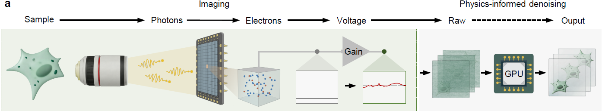
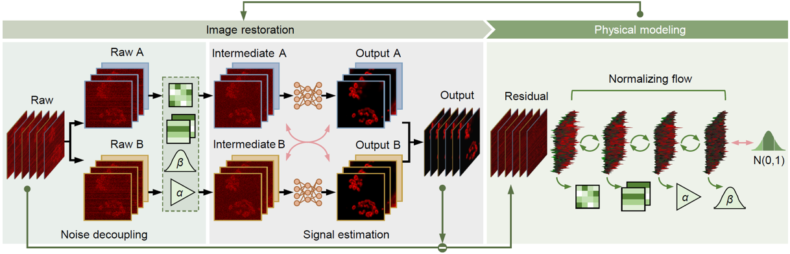
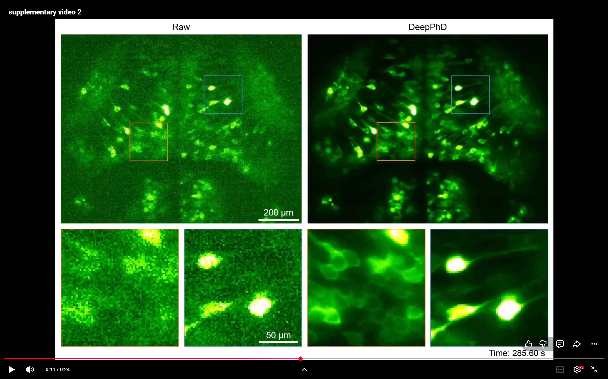
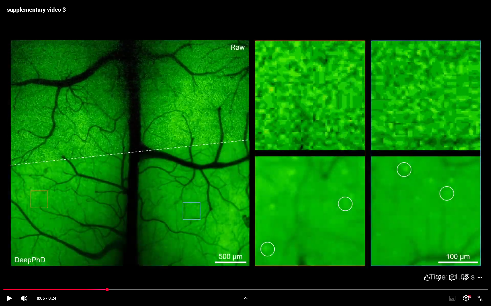
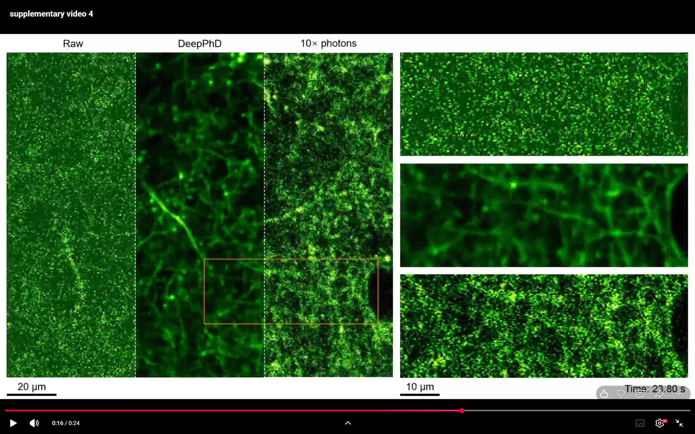

# DeepPhD: Physics-informed self-supervised denoising for fluorescence imaging

### [Project page](https://cabooster.github.io/DeepPhD/) | [Paper](https://cabooster.github.io/DeepPhD/)

## Contents

- [Overview](#overview)
- [Installation](#installation)
- [Quick Start](#quick-start)
- [Sensor / Architecture Presets](#sensor--architecture-presets)
- [Repository Layout](#repository-layout)
- [Q&A](#qa)
- [Results](#results)
- [Citation](#citation)

## Overview

Fluorescence microscopy is fundamentally limited by noise, which compromises imaging sensitivity and obscures biological phenomena. Noise originating from different optoelectronic sources exhibits distinct statistical properties; this heterogeneity poses critical challenges for reliable noise removal.

<p align="center">
  
</p>

**DeepPhD** (<ins>Deep</ins> <ins>Ph</ins>ysics-informed <ins>D</ins>enoising) is a **physics-informed, self-supervised** denoising framework that synergizes fluorescence image restoration with **explicit noise modeling**. By modeling heterogeneous noise components within a learnable normalizing flow and informing the restoration network with estimated noise parameters, DeepPhD reinforces noise decoupling and signal estimation **without requiring any clean images**.

<p align="center">
  
</p>

The measurement model covers the dominant noise sources in fluorescence imaging:

| Component | Meaning |
|-----------|---------|
| **MPGN** | Mixed Poisson–Gaussian noise (shot + dark/readout) |
| **FPN** | Fixed-pattern noise (time-invariant spatial offset) |
| **RN** | Row noise (time-varying row-wise stripe) |

Camera-based modalities (e.g., light-sheet, widefield CMOS) typically use the full model `fpn|rn|mpgn`. PMT-based multiphoton imaging reduces to `mpgn` only (FPN/RN constrained to zero).

We demonstrate DeepPhD on diverse modalities and biological processes, including:

- Light-sheet imaging of GABAergic neurons in larval zebrafish
- Widefield neural imaging of freely behaving mice (head-mounted miniaturized microscopy)
- Multiphoton imaging of dendritic spines and immune-cell (neutrophil) migration

DeepPhD improves both denoising performance and interpretability, facilitating reliable biological observation under photon-limited conditions.

## Installation

### Recommended environment

- Linux (recommended)
- Python **3.10**
- NVIDIA GPU + CUDA **12.x**
- A recent **PyTorch** build that supports your GPU (choose the matching CUDA wheel from [pytorch.org](https://pytorch.org/get-started/locally/))

### Setup

```bash
git clone https://github.com/cabooster/DeepPhD.git
cd DeepPhD
conda create -n deepphd python=3.10 -y
conda activate deepphd
```

Install PyTorch for your CUDA / GPU first. Use the selector on [pytorch.org](https://pytorch.org/get-started/locally/) and pick a version compatible with your driver and GPU (newer cards such as RTX 5090 need a recent build with the matching architecture support). Example for CUDA 12.1:

```bash
pip install torch==2.8.0 torchvision==0.23.0 torchaudio==2.8.0 \
    --index-url https://download.pytorch.org/whl/cu128
```

Then install the remaining packages:

```bash
pip install -r requirements.txt
```

Verify the install:

```bash
python -c "import torch; print(torch.__version__, torch.cuda.is_available())"
```

### Data format

Place input volumes as multi-page **TIFF** stacks (`.tif`) under a folder, e.g.:

```text
your_dataset/
  ├── stack_001.tif
  └── stack_002.tif
```

Each TIFF should be shaped as `T × H × W` (time/depth × height × width). Short temporal sequences are automatically expanded for training when fewer than 400 frames are available.

**All stacks in the same directory must be acquired with the same imaging device (sensor),** so that shared physical noise parameters (e.g., FPN pattern and MPGN gain/variance) remain consistent within one training or inference run. Do not mix data from different cameras or microscopes in one folder.

## Quick Start

### 1. Training

```bash
python DeepPhD_train.py \
  --exp_dir demo_zebrafish \
  --datasets_path /path/to/your_dataset \
  --sensor_type CMOS \
  --save_noise
```

By default, training uses GPUs `0,1`. Override with `--gpu` if needed (e.g. `--gpu 0` or `--gpu 0,1,2`).

Common arguments:

| Argument | Description |
|----------|-------------|
| `--exp_dir` | Experiment name; logs and checkpoints are written to `results/<exp_dir>/` |
| `--datasets_path` | Folder containing input `.tif` stacks |
| `--sensor_type` | `CMOS` → `fpn\|rn\|mpgn` (default); `PMT` → `mpgn` |
| `--arch` | Explicit physical flow, e.g. `fpn\|rn\|mpgn` or `mpgn` (overrides `--sensor_type`) |
| `--gpu` | GPU id(s), comma-separated (default `0,1`) |
| `--fresh_start` | Delete the existing experiment directory and train from scratch |
| `--save_noise` | Save learned FPN / estimated RN maps during the final validation pass |
| `--seed` | Random seed (default `0`) |

Checkpoints are saved as:

```text
results/<exp_dir>/saved_models/epoch_<N>.pth
```

Denoised outputs (and optional noise maps) are written under `results/<exp_dir>/`.

### 2. Inference

```bash
python DeepPhD_inference.py \
  --exp_dir demo_zebrafish \
  --datasets_path /path/to/your_dataset \
  --sensor_type CMOS \
  --save_noise
```

| Argument | Description |
|----------|-------------|
| `--exp_dir` | Experiment name or absolute path to the training log directory |
| `--epoch` | Checkpoint epoch to load (default: latest) |
| `--arch` / `--sensor_type` | Must match the trained physical model |
| `--datasets_path` | Folder of TIFF stacks to denoise |
| `--gpu` | GPU id(s), comma-separated (default `0,1`) |
| `--save_noise` | Export estimated RN / learned FPN maps |

**Example (PMT / multiphoton):**

```bash
python DeepPhD_train.py \
  --exp_dir demo_2p \
  --datasets_path /path/to/pmt_data \
  --sensor_type PMT
```

## Sensor / Architecture Presets

| Preset | `--sensor_type` | Equivalent `--arch` | Typical use |
|--------|-----------------|----------------------|-------------|
| Camera (CMOS / sCMOS) | `CMOS` | `fpn\|rn\|mpgn` | Light-sheet, widefield, head-mounted CMOS |
| Photomultiplier | `PMT` | `mpgn` | Multiphoton / scanning PMT |

If both `--arch` and `--sensor_type` are provided, `--arch` takes precedence.

## Repository Layout

```text
DeepPhD/
├── DeepPhD_train.py          # Training entry
├── DeepPhD_inference.py      # Inference entry
├── requirements.txt          # Pip pins for non-torch dependencies
├── model/
│   ├── DeepPhD.py            # Joint physics + 3D U-Net model
│   ├── network/              # 3D U-Net denoiser
│   └── noise_model/          # FPN / RN / MPGN normalizing-flow modules
├── data_loader/              # Patch partitioning, augmentation, dataloaders
└── utils/
    ├── arg_parser.py         # CLI, GPU visibility, checkpoint helpers
    └── inference_io.py       # Patch-wise inference and TIFF export
```

## Q&A

### Q1: How do I choose between CMOS and PMT presets?

**A1:** Use `CMOS` (full `fpn|rn|mpgn`) for camera sensors that exhibit fixed-pattern and row noise. Use `PMT` (`mpgn` only) for multiphoton / scanning detection where all pixels share one photoconversion and readout channel.

### Q2: Training resumes from an old run unexpectedly.

**A2:** By default, if `results/<exp_dir>/saved_models/` already contains checkpoints, training continues from the latest epoch. Pass `--fresh_start` to clear the experiment directory and start over.

### Q3: Multi-GPU training / inference.

**A3:** Default is `--gpu 0,1`. Pass other comma-separated device ids as needed (e.g. `--gpu 0` or `--gpu 0,1,2`). Visibility is set via `CUDA_VISIBLE_DEVICES` before CUDA initialization.

### Q4: Can I mix stacks from different microscopes in one folder?

**A4:** No. Keep only data from the same imaging device in each `--datasets_path` directory, because DeepPhD learns a shared physical noise model (including FPN) per run.

## Results

1. DeepPhD enables ultrasensitive light-sheet imaging of GABAergic neurons in larval zebrafish.

[](https://youtu.be/9wG65MiFMAs)

2. DeepPhD enables high-fidelity neural recording of freely behaving mice using head-mounted miniaturized microscopy.

[](https://youtu.be/Yn_954OcvZI)

3. DeepPhD reveals calcium transients of dendritic spines in the mouse cortex.

[](https://youtu.be/1bM43gqU6ik)

